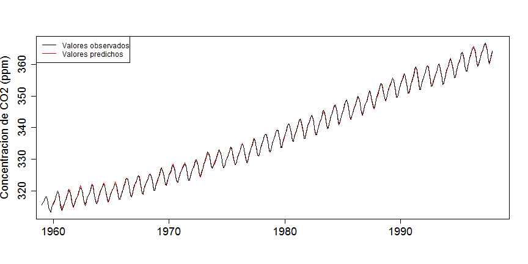
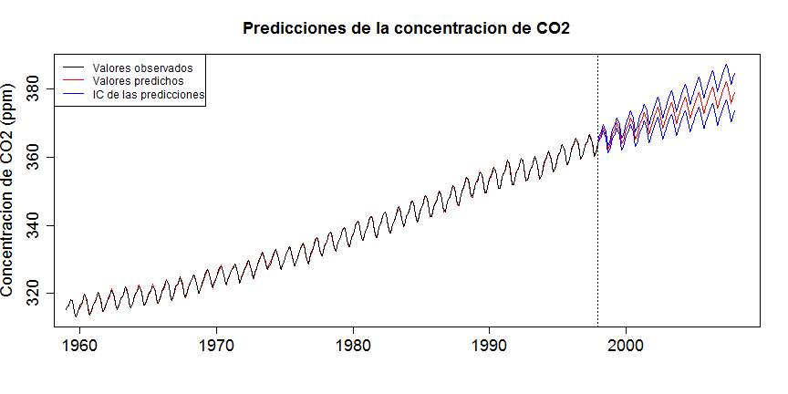
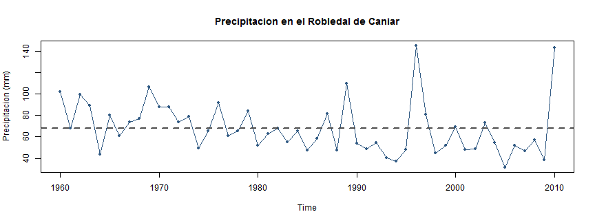
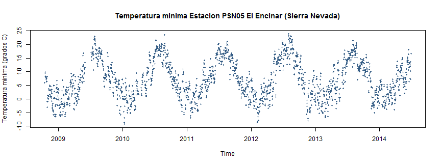
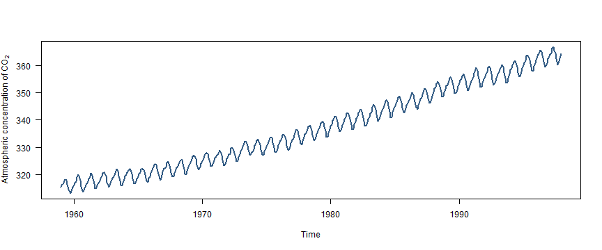
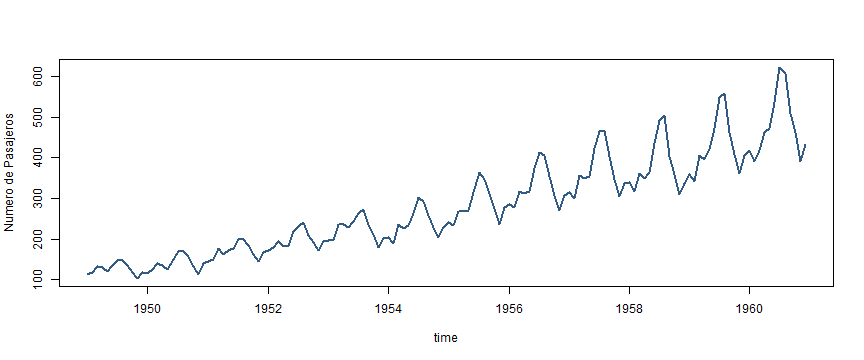

<!-- Center image on slide -->
<script src="http://ajax.aspnetcdn.com/ajax/jQuery/jquery-1.7.min.js"></script>
<script type='text/javascript'>
$(function() {
    $("p:has(img)").addClass('centered');
});
</script>


<style>
em {
  font-style: italic
}
strong {
  font-weight: bold;
}
</style>

<!-- Limit image width and height -->
<style type='text/css'>
img {
    max-height: 560px;
    max-width: 964px;
}
</style>

--- .quote
<br>
<br>
<br>
<q align=right>¿Qué es una <br>__Serie Temporal__? </q>

--- 
* Conjunto de observaciones registradas a intervalos regulares de tiempo. 
* En cada instante $\t_{i}$ la observación proviene de una variable que puede tener igual o diferente distribución
* El orden de llegada de los datos es importante

* Ejemplos: temperaturas, productividad del bosque a lo largo del año, cantidad de agua que lleva un río cada día, etc.  

* 

--- .quote
<br>
<br>
<br>
<q align=right>¿Por qué nos interesa analizar una <br>__Serie Temporal__? </q>

--- 
 * Para comprobar la ciclidad de un fenómeno
 * Analizar si los datos se ajustan bien a un modelo teórico
 * Analizar fenómenos espacio-temporales (avanzado)

<iframe width="250" height="150" frameborder="0"
  src="http://player.vimeo.com/video/104330415?title=0&amp;byline=0&amp;portrait=0" >
</iframe>

--- 
## Evolución de un proceso ecológico en diferentes ecosistemas

<iframe width="250" height="150" frameborder="0"
  src="http://player.vimeo.com/video/22945147?title=0&amp;byline=0&amp;portrait=0" >
</iframe>

--- .quote
## Objetivos:
__Explicar la evolución de un fenómeno a lo largo del tiempo__ 

 


--- .quote
## Objetivos
__Predecir su valores en el futuro__

 


--- .quote
<br>
<br>
<br>
<q align=right>__Tipos__ de Series Temporales? </q>


--- .quote
## Estacionarias 
 


> * Los datos varían todo el tiempo alrededor del mismo __valor medio__ y con la __misma variabilidad__. 
* La relación entre las observaciones en dos momentos del tiempo diferentes
sólo depende del número de observaciones que distan entre ambas

[Observatorio de Cambio Global de Sierra Nevada](https://obsnev.es/linaria)

--- .quote
## No Estacionarias 
 


> * La media, la varianza y/o la relación entre distantes equiespaciados __cambian__ a lo largo del tiempo. 
* Algunas oscilan con periodicidad regular (estacional)


--- .quote
## No Estacionarias 
 


> * Tendencia (serie no estacionaria estacional con tendencia)

--- 
## No Estacionarias  
 


> * Aumenta la variabilidad con el tiempo (serie no estacionaria con aumento de variabilidad)

---

Tutoriales 
Falk M (2012). A First Course on Time Series Analysis - Examples with SAS. Chair of Statistics, University of Wurzburg. [link](http://www.statistik-mathematik.uni-wuerzburg.de/wissenschaftforschung/time_series/the_book/) 

--- 
## Test de Mann-Kendall 
comparacion con una reg. lineal

--- 
## Mann-Kendall test
* Es un caso especial del test de correlación de Kendall ($\tau$)
  * mide la asociación entre dos variables 
* Basado en el ranking relativo de los datos (no sobre los datos en sí)

* Hipótesis:
 * $\H_{0}:$ Los valores de la serie de datos son independientes 
 * $\H_{1}:$ Existe una tendencia monotóna (no necesariamente lineal)
  H0: Time series values are independent, identically distributed
 HA: There is a monotonic (not necessarily linear) trend 

* Se calcula un valor de un estadístico ($\tau$):

$\tau = 0$ : 
 
Supongamos que tenemos un conjunto de observaciones de dos variable aleatorias, ___X___ e ___Y___: 
$(x_1,y_1),(x_2,y_2),\hdots,(x_n,y_n)$
Decimos que un par de observaviones $(x_i,y_i)$ y $(x_j,y_j)$ son concordantes si los rangos de ambos elementos concuerdan:
* $x_i > x_j$ y $y_i > y_j$ o
* $x_i < x_j$ y $y_i < y_j$ 
Decimos que un par de observaciones son discordantes si: 
* $x_i > x_j$ y $y_i < y_j$ o
* $x_i < x_j$ y $y_i > y_j$ 

El valor del estadístico $\tau$ lo calculamos como:
$\tau=\frac{(\textup{n pares concordantes})-(\textup{n pares discordantes})}{\frac{1}{2}n(n-1)}$ 

Resultados
* If the agreement between the two rankings is perfect (i.e., the two rankings are the same) the coefficient has value 1.
If the disagreement between the two rankings is perfect (i.e., one ranking is the reverse of the other) the coefficient has value −1.
If X and Y are independent, then we would expect the coefficient to be approximately zero.


Let (x1, y1), (x2, y2), …, (xn, yn) be a set of observations of the joint random variables X and Y respectively, such that all the values of (xi) and (yi) are unique. Any pair of observations (xi, yi) and (xj, yj) are said to be concordant if the ranks for both elements agree: that is, if both xi > xj and yi > yj or if both xi < xj and yi < yj. They are said to be discordant, if xi > xj and yi < yj or if xi < xj and yi > yj. If xi = xj or yi = yj, the pair is neither concordant nor discordant.


El test de Mann Kendall es un test estadístico ampliamente utilizado para el análisis de tendencias en series de datos temporales que se ha utilizdo ampliamente en climatología e hidrología. 

Existen varias ventajas: 
* Es un test no paramétrico (no requiere que asumamos distribuciones en los datos)
* Tiene una baja sensibilidad para cambios abruotos 

Mann Kendall test is a statistical test widely used for the analysis of trend in climatologic
[9] and in hydrologic time series [6]. There are two advantages of using this test. First, it
is a non parametric test and does not require the data to be normally distributed. Second,
the test has low sensitivity to abrupt breaks due to inhomogeneous time series [4]. Any
data reported as non-detects are included by assigning them a common value that is
smaller than the smallest measured value in the data set [7]. According to this test, the
null hypothesis H0 assumes that there is no trend (the data is independent and randomly
ordered) and this is tested against the alternative hypothesis H1, which assumes that there
is a trend. [3]


--- &twocol
# Fraude científico
<br>
*** =left
<p align="center"></p>

*** =right
<p align="center"></p>

--- &twocol
# Retracción
*** =left
<br>
<p align="center"></p>

*** =right
<p align="center"></p>


--- .quote .smaller
<p align="center"></p>


> * La investigación no son sólo los resultados que se publican, sino que es el conjunto de programas, código, y datos utilizados para producir los resultados (Gandrud 2014)


--- 
# Meta-analysis on the effects of temperature on plant phenology


[Wolkovich et al. 2012](https://dx.doi.org/10.1111/j.1365-2486.2012.02693.x)


--- .quote
<br>
<br>
<br>
<q align=right>¿Qué entendemos por <br>__Reproducible Science__? </q>


--- .quote 
<br>
<br>
<q> Research results are __replicable__ if there is sufficient information available for independent researchers to make the same findings using the same procedures </q>  


--- 
## Por la _ciencia_ 
* __Evitar duplicación de esfuerzos__
  * Disminuir la cantidad de tiempo empleado para colectar datos, manipular datos, etc.
  * Ayuda a avanzar en la generación de nuevo conocimiento ([Wolkovich et al. 2012](https://dx.doi.org/10.1111/j.1365-2486.2012.02693.x))

<p align="center"></p>

---  
## Por los _investigadores_  (por ti)

> * __Mejorar Habitos de trabajo__
  * Aumentar la facilidad para detectar errores (documentar código)
  * Accesibilidad de los pasos llevados a cabo (re-usabilidad)
  * Efectividad (evitar duplicidad de esfuerzo)
> * __Mejorar Trabajo en equipo__
  * Implementar la reproducibilidad de un proyecto facilita a tus colaboradores (presentes o futuros) ejecutar parte del mismo
 
> * __Facilitar los cambios__
   * Reproducir tus resultados en el futuro próximo (re-análisis, cambios en figuras, etc.)
> * __Mayor impacto de nuesta investigación__
  * La investigación que es reproducible contiene mas información (código, acceso a los datos, etc) y por tanto, mas razones para ser usada (y citada, i.e. [Piwowar et al. 2007](http://dx.doi.org/10.1371/journal.pone.0000308))
  

--- .smaller
__Aplicar técnicas de reproducibilidad (o al menos los principios) puede hacer que tu investigación sea mas efectiva y mas fácil__
<br>
<br>


--- .quote
<br>
<br>
<br>
<q align=right>¿Cómo hacer que nuestra investigación <br> sea mas __reproducible__? </q>

--- 
## Flujo de Trabajo Científico 
# The old-(_traditional_) way


---
## Comunicamos los resultados 

> - ¿Qué análisis has llevado a cabo para generar una figura? ¿Cómo has llevado a cabo el análisis de las medias? ¿Has tenido en cuenta la correlación entre las variables? ... 

<br>  
> - ¿Qué datos has utilizado? ¿Has llevado a cabo un filtro previo de los datos? ¿de qué tipo? ¿Has utilizado valores brutos o valores agregados? ...

<br>  
> - ¿Has probado a llevar a cabo el análisis utilizando la media armónica en vez de la media aritmética? ¿Qué resultados obtendríamos si agregamos los valores por meses en vez de por estaciones? ... 

<br>  
> - ¿Podrías incluir en la figura además unas barras de error? ¿Podrías incluir en la tabla los I.C. al 99% en vez de al 95%? 

--- .quote
Este flujo de trabajo está __roto__ 

<br>

<p align="center"></p>


--- .quote
## Consejos prácticos 
<br>
__1. Document everything!<br><br>__
__2. Everything is a (text) file<br><br>__
__3. All files should be human readable<br><br>__ 
__4. Explicity tie your files together<br><br>__
__5. Have a plan to organize, store, and make our files available__

--- 
## The big picture 


--- 
### Algunas reglas sencillas ([Sandve et al. 2013](https://dx.doi.org/10.1371/journal.pcbi.1003285))
__`Rule 1.`__ __For every result, keep track of how it was produced__ 
  * Si un resultado puede ser de potencial interés, mantén un registro de como se ha producido. 
  * `Mínimo`: registrar detalles suficientes sobre los programas, parámetros y procedimientos manuales para ser capaz (al menos tú) de reproducir el resultado cuando pase un tiempo

__`Rule 2.`__ __Avoid manual data manipulation steps__ 
  * Los procedimientos manuales son __ineficientes__, propensos a los __errores__ y difíciles (sino imposibles) de reproducir. 
  * Sustituir modificación manual de archivos por uso de comandos o pequeños scripts (mejor comprensión + track errores + fácilmente reproducibles (1-click))
  * `Mínimo`: Si la utilización de operaciones manuales no pueden evitarse en tu análisis, anota al menos los archivos que son modificados o movidos y para que propósito


--- .codefont .centrepre .bigger 
__`Rule 3.`__ __Archive the exact versions of all external programs used__ 
  * Programas y versiones 
  * `Mínimo`: Anotar nombres y versiones de los programas utilizados (metadatos) 
  

```r
sessionInfo()
```


<p align="center"></p>


```r
sink("sessionInfo.txt")
sessionInfo()
sink()
```

<br>
[packrat: A Dependency Management System for Projects and their R Package
Dependencies](http://rstudio.github.io/packrat/)

--- .codefont .centrepre .bigger 
__`Rule 4.`__ __Version Control all custom scripts__ 
 * Registrar los cambios realizados en los scripts que utilizamos 
 * `Mínimo`: Archivar copias de los scripts cada vez que hagamos cambios en ellos, para mantener un registro exahustivo de los cambios que hemos realizado en ellos. 

__`Rule 5.`__ __Record all intermediate results, when possible in standardized formats__
 * Tener acceso a resultados intermedios es de gran valor: 
  * Un vistazo rápido de resultados intermedios puede servirnos para revelar discrepancias, falsas asunciones, etc. que no podemos ver en los resultados finales. 
  * Parámetros arbitrarios en pasos intermedios
* `Mínimo`: Guardar archivos y resultados intermedios (siempre que el espacio no nos limite)


--- .codefont .bigger .centrepre
__`Rule 6.`__ __For analysis that include randomness, note underlying random seeds__
* No reproducible. 

```r
# Crea un conjunto de datos
x <- seq(0, 30, by = 0.5)
head(x)
```

```
## [1] 0.0 0.5 1.0 1.5 2.0 2.5
```

```r
# Toma una muestra de 5 individuos
sample(x, 5)
```

```
## [1]  6.5  0.5 13.0  8.0  2.0
```

```r
sample(x, 5)
```

```
## [1]  5.0 29.5 15.5  2.0  7.0
```


--- .codefont .bigger .centrepre
__`Rule 6.`__ __For analysis that include randomness, note underlying random seeds__
* Reproducible. 

```r
set.seed(1)
sample(x, 5)
```

```
## [1]  8.0 11.0 16.5 26.0  5.5
```

```r
# Repite la operaci?n
set.seed(1)
sample(x, 5)
```

```
## [1]  8.0 11.0 16.5 26.0  5.5
```


* Semilla inicial en aleatoridad (re-sampling, bootsprating, Monte-Carlo, etc)
* `Mínimo`: Anotar los pasos del análisis que implican aleatoridad (saber donde encontraremos discrepancias)

--- 

__`Rule 7.`__ __Always store raw dat behind plots__ 
 * Capacidad de regenerar figuras de forma sencilla


 
  * Realizar gráficos en R (script), nos permite regenerarlos en 1 solo paso
  * `Mínimo`: Anotar que datos forman parte de la base de una figura y como podemos generar esos datos. 

---
## Algunos recursos 

* [Reproducibility Guide (ROpenSci and others contributors)](http://ropensci.github.io/reproducibility-guide/contributors/)

* [Initial steps toward reproducible research (Karl Broman)](http://kbroman.org/steps2rr/)

<p align="center"></p>

--- .quote

<br>
<br>
<br>
<q align=right>¿Cómo generar informes <br>__reproducibles__? </q>

--- .codefont .centrepre .bigger .quote
## Markdown 
* Es un lenguaje de marcas sencillo con una sintáxis de texto plano 
* Permite agregar formatos a textos de una forma sencilla 
* .md
* Tutoriales:
  * [Markdowntutorial](http://markdowntutorial.com/)

## R + Markdown = Rmarkdown 
* Permite reproducibilidad total
* Dinámico (1 click)
* Permite generar informes, documentos, presentaciones, etc. [ejemplo artículo](https://github.com/karthik/markdown_science)
* Tutoriales
  * [R Markdown — Dynamic Documents for R](http://rmarkdown.rstudio.com/)
  * [Reproducible Research with Rmarkdown](http://pakillo.github.io/Rmarkdown_tutorial/) 
  * [Reproducible Research with R and RStudio](http://www.crcpress.com/product/isbn/9781466572843) 
  

--- 
## Ejemplos 
<p align="center"></p>


* [Evaluación de la sequía en los últimos 110 años en California](https://github.com/macroecology/Drought_CA/blob/master/pdsi/averagePdsi/average_pdsi_year.md)
* [Análisis de variables climáticas en el periodo 1960-2010 en Sierra Nevada](https://github.com/ajpelu/ajpeluR/blob/master/prueba/trend_past_climate.md)

--- .quote

<br>
<br>
<br>
<q align=right>¿Cómo gestionamos las <br>__versiones__? </q>

---

<br>
[phdcomic](http://phdcomics.com/)

--- 

<br>
[phdcomic](http://phdcomics.com/)

---
## ¿Qué es el control de versiones? 

El __control de versiones__ es un sistema que registra los cambios realizados sobre un archivo o conjunto de archivos a lo largo del tiempo, de modo que podamos recuperar versiones específicas más adelante
* Se puede utilizar sobre cualquier archivo. 
* Permite: 
  * Revertir archivos (proyecto) a un estado anterior
  * Comparar cambios a lo largo del tiempo
* Facilita la identificación de errores 

--- 
## Lenguajes para el control de versiones 

<br>
<br>
<p align="center"></p>

<br><br>
[ProGit book](http://git-scm.com/book/en/v2) 

--- &twocol
## GitHub
*** =left
* Un website donde alojar repositorios 
* Interfaz para explorar repositorios
* Permite colaborar de una forma más eficaz (programadores):
 * Compartir repositorio
 * Ver cambios
 * Corregir errores 
 * Discutir y Revisar cambios

*** =right
<p align="center"></p>
<br>
https://github.com/

--- 


--- 


--- 


--- 
## Un sencillo tutorial sobre Git 

Recursos:
* [Interactive Tutorial Git (CodeSchool)](https://try.github.io/levels/1/challenges/1)
* [Git - the simple guide (Roger Dudler)](http://rogerdudler.github.io/git-guide/index.es.html)
* [Git and GitHub (Hadley Wickham)](http://r-pkgs.had.co.nz/git.html)
* [A brief introduction to git & GitHub (Karl Broman & Samuel G. Younkin)](https://www.biostat.wisc.edu/~kbroman/talks/GitPrimer.pdf)
* [A basic tutorial to version control using git (Jon Lefcheck)](http://jonlefcheck.net/2013/11/04/a-basic-tutorial-to-version-control-using-git/)
* [Git/Github guide a minimal tutorial (Karl Broman)](http://kbroman.org/github_tutorial/)
* [Getting Git Right (Atlassian)](https://www.atlassian.com/git/tutorials/setting-up-a-repository) 
* [Recopilación de tutoriales (F. Rodríguez-Sánchez)](https://gist.github.com/Pakillo/63c15c700c9c76fe8032)


--- .codefont .centrepre .bigger .quote

## Crear un repositorio nuevo
* Crea un directorio nuevo y ábrelo

```
mkdir <nombre_directorio>
```

```{}
mkdir datos
cd datos
```

* Para __iniciar un repositorio__ utilizamos el comando

```{}
git init
```

<br>
<br>

[Ayuda sobre comandos](http://overapi.com/linux/)

--- .codefont .centrepre .bigger .quote
## Añadir cambios 
* Inspeccionar el directorio

```
ls -a 
```


```r
.  ..  .git
```


* Añadir cambios 

```{}
git add <nombre_archivo>
```
```
git add misdatos.md
```
* Si quiero añadir todos los archivos 

```
git add . 
```

--- .codefont .bigger 
## Registrar cambios 

```{}
git commit -m "Commit message""
```

```{}
git commit -m "Escribo mis datos personales en archivo"
```


```r
[master (root-commit) 71fe224] Escribo mis datos personales en archivo
 1 file changed, 2 insertions(+)
 create mode 100644 misdatos.md
```


--- bg:url(images/esquema_git.png)

--- .minicodefont .bigger
## Enviar cambios 
Nuestros cambios están en el __`HEAD`__ (copia local)
* Queremos __`enviar`__ los cambios a un repositorio remoto:
  * Conectar con un repositorio remoto (¡ojo necesitamos crear uno o clonarlo!)
  
```
git remote add origin <server>
```

```
git remote add origin https://github.com/ajpelu/ecoinformatica_2014_2015_ajpelu.git
```

* Para enviar cambios (una vez conectados) a un repositorio remoto 

```
git push origin master
```

* Nos pedirá usuario y contraseña. 

--- 
## Reto 4_1 
* Crear una cuenta en [github](https://github.com) 

* Crear un repositorio llamado __`ecoinfo_2014_2015_reto_4_1`__ 

--- .codefont .bigger .quote
## Clonar un directorio

* Importante para reproducibilidad
* Colaboración 
* Repositorio remoto (`GitHub`)

comando: 
```{}
git clone username@host:/path/to/repository
```
<br>
ejemplo:
```
git clone git@github.com:iecolab/ecoinformatica_2014_2015_ajpelu.git 
```

--- .codefont .centrepre .bigger .quote
## Actualizar, fusionar 

* Si queremos actualizar un repositorio local al último cambio 

```
git pull  
```

```
git pull origin master 
```

--- 
## Reto 4_2
* Clonar el repositorio [GitHub](https://github.com/iEcolab/ecoinformatica_2014_2015) de la asignatura  

* Subir todos tus retos del resto de la asignatura a su carpeta correspondiente

--- 


--- .smaller
# References and Resources

* Chacon S & Straub (2014) ProGit book. Apress [pdf](http://git-scm.com/book/en/v2) 

* FitzJohn R, Pennell M, Zanne A and Cornwell W (2014) Reproducible research is still a challenge. [link](http://ropensci.org/blog/2014/06/09/reproducibility/) 

* Gandrud C (2014) Reproducible research with r and rstudio. R Series. Chapman & Hall/CRC. 

* King G (1995) Replication, replication. PS: Political Science and Politics, 28(3): 444 - 452. doi:  [10.2307/420301](http://dx.doi.org/10.2307/420301)

* Michener WK, Brunt JW, Helly JJ, Kirchner TB, Stafford SG (1997). Nongeospatial metadata for the ecological sciences. Ecological Applications, 7(1): 330?342. [doi](http://www.esajournals.org/doi/full/10.1890/1051-0761%281997%29007%5B0330%3ANMFTES%5D2.0.CO%3B2)

* Peng RD (2011) Reproducible research in computational science. Science, 334: 1226 - 1227. doi: [10.1126/science.1213847](https://dx.doi.org/10.1126/science.1213847)

* Piwowar HA, Day RS, Fridsma DB (2007) Sharing detailed research data is associated with increased citation rate. PLoS ONE 2(3): e308. doi: [10.1371/journal.pone.0000308](http://dx.doi.org/10.1371/journal.pone.0000308)

--- .smaller
# References and Resources
* Rodriguez-Sánchez F (2014) Reproducible Research with Rmarkdown. Data management, analysis, and paper writing all-in-one. [slides](http://pakillo.github.io/Rmarkdown_tutorial/)

* Rodriguez-Sánchez F (2014) Reproducible Science with Rmarkdown [slides](Reproducible Science with Rmarkdown)

* Sandve GK, Nekrutenko A, Taylor J, Hovig E (2013) Ten Simple Rules for Reproducible Computational Research. PLoS Comput Biol 9(10): e1003285. doi: [10.1371/journal.pcbi.1003285](https://dx.doi.org/10.1371/journal.pcbi.1003285)

* Stodden V (2009) The legal framework for reproducible scientific research. Computing in Science & Engineering, 11(1): 35 - 40. doi: [10.1109/MCSE.2009.19](http://dx.doi.org/10.1109/MCSE.2009.19)

* Wolkovich EM, Regetz J & O'Connor MI (2012) Advances in global change research require open science at the individual-level. Global Change Biology, 18, 2102?2110, doi: [10.1111/j.1365-2486.2012.02693.x](https://dx.doi.org/10.1111/j.1365-2486.2012.02693.x)

* Reproducibility in Science. A Guide to enhancing reproducibility in scientific results and writing. [R-OpenSci et al](http://ropensci.github.io/reproducibility-guide/)  

* [Reproducible Science Curriculum](https://coggle.it/diagram/548607a4d215ff3b06948849/0353189d659223de746d754b8d10bca50186a23b2c5bc183a7e195ea4efa2944)

--- 


